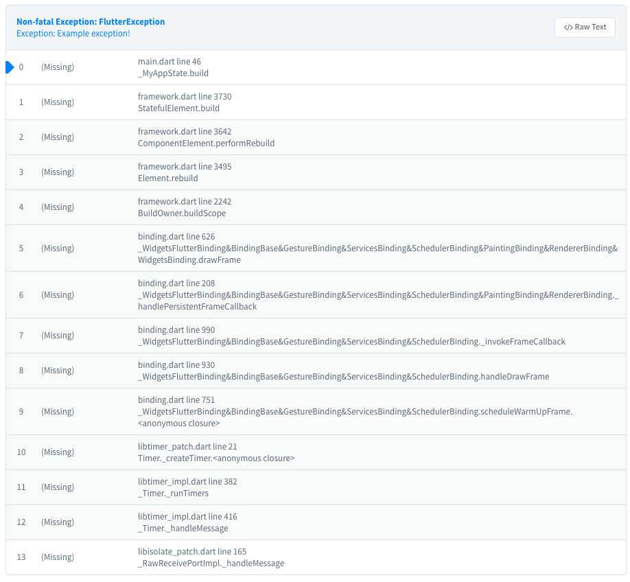

# Crashlytics

**This is Craslytics unofficial plugin!**

Flutter plugin for [(Fabric) Crashlytics](https://fabric.io/kits/ios/crashlytics) on Android and iOS.

## Getting Started

Check out the example directory for a sample app using Craslytics.

To use Crashlytics, you need the Frabric account.

### Android Integration

1. Install the Fabric Gradle Plugin. Follow [Crashlytics Install Guid](https://fabric.io/kits/android/crashlytics/install) > **Add the Kit to Your build.gradle** Section. But you don't need crashlytics artifact. (See the `example` Android App.)
2. Add API Key into your App's `AndroidManifest.xml`. Follow [Crashlytics Install Guid](https://fabric.io/kits/android/crashlytics/install) > **Add Your API Key** Section.

### iOS Integration

1. Add a script into your App. Follow [Crashlytics Install Guid](https://fabric.io/kits/ios/crashlytics/install) > **Add a Run Script Build Phase** Section.
2. Add API Key into your `Info.plist`. Follow [Crashlytics Install Guid](https://fabric.io/kits/ios/crashlytics/install) > **Add Your API Key** Section.

### Dart Integration

Call `Crashlytics.setup()` before `runApp()`.

Then, you can see uncaught exceptions in Crashlytics dashboard.

## Limitation

Crashlytics doesn't support Dart & Flutter exception reporting.
So this plugin has some limitations.

* All exceptions are reported as **Non-Fatal** error.
* Coloring of StackTrace on Crashlytics report screen is little strange.
